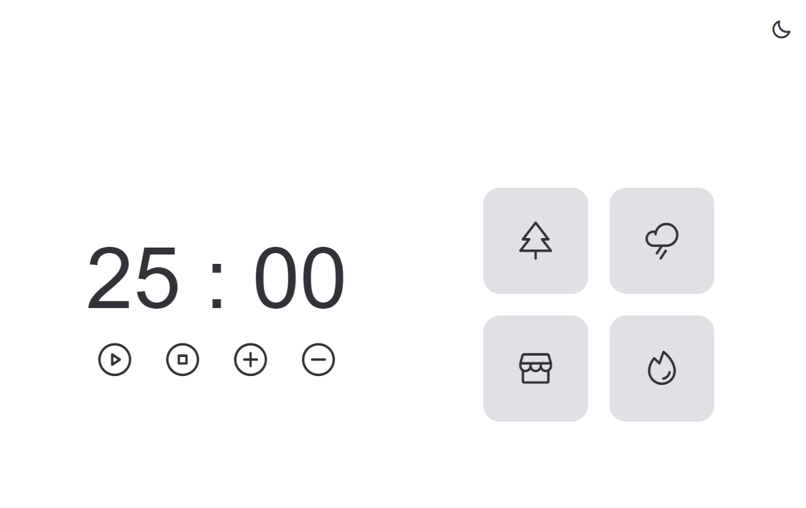

<h1 align="center"> FocusTimer 2.0 </h1>

  <a href="#-technologies">Technologies</a>&nbsp;&nbsp;&nbsp;|&nbsp;&nbsp;&nbsp;
  <a href="#-project">Project</a>

 

  

## 🚀 Technologies

This project was developed with the following technologies:

- HTML and CSS
- Javascript
- Git and GitHub
- Figma

## 💻 Project

- [Access the finished project, online](https://smothemerson.github.io/FocusTimer2.0/)

- Project given by Rocketseat in Stage 05 of the Explorer Course
